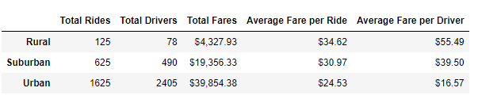

#PyBer Analysis
## Overview of Project, tools used, and process.
### Tools used: jupyter notebook, pandas, python, Matplotlib
 This analysis gives users information on trending fares for each city type for the requested months of January 2019- April 2019. To accomplish this task, I generated a ride-sharing summary DataFrame using jupyter notebook, pandas, and python, which details the total number of rides, the total number of drivers, the total fares, as well as the average fare per ride and average fare per driver for each city type. After generating this data, we can manipulate it by using different methods and functions (loc, resample, pivot, clearing the index, and adjusting the dataframe into a datetime data type) to target the specific desired dates that were requested. Once all of these methods and functions were applied, we granulated the data enough from the large dataset to use Matplotlib to generate the graph.

## Results derived from data

According to the United States Census Bureau, rural areas are known as places that have open coutnry and contain populations with fewer than 2,500 residents. Urbanized areas, may contain areas of urban cities that may or may not be individual- meaning there may be multiple cities in an 'urban' area, that doesn't necessarily follow a certain municipal boundary distinguished by geographic classification (unlike rural areas). With this being said, urban areas are distinguished by containing a population of 50,000 people or more, with a population density of 1,000 people per square mile. Uniquely, urban cities generally have a 'core' or 'nucleus' that is centralized that demonstrates this increased population denisty. There is no offical classification from the Census Bureau for suburban areas, due to statistical markers for both urban and rural areas (with having official classification) being applicable to suburban areas, however, depending on what context these statistical markers used for classification are used in, the definition can change. For the sake of simplicity, we shall define suburban areas as areas that when compared to urban areas contain a lower population density and tend to separate residential and commercial areas from one another.

Ride-sharing has become a popular method of communal travel, and is defined as "the practice of arranging for travel in a private vehicle driven by its owner, free or for a fee, especially by means of a website or app." In this analysis, the goal was to generate a graph comparing fares by city type across time. To achieve this, two datasets were merged together and a number of intermediary steps fragmenting that data occured. This fragmented data detailed total rides, total drivers, total fares, average fare per ride and driver, 
and total fare by city type. While all this information did not appear in the final product of the multiline graph, it is not negligible in what can be derived from it, and tells a story that still has value.

Initial analysis of the different city types show the following:

- The more urbanized an area becomes, the greater the total Rides and total Drivers.

- Total Fares also increases as an area becomes more urbanized.

- Average Fare per Ride and Average Fare per Driver are the only values that drop as an area becomes more urbanized.

- Rural areas carry the highest average fare, with the highest average fare per ride. How this happens may be due to the fact that there are so few drivers. In rural areas, ridesharing may be considered more of a luxury, as compared to suburban and urban areas where the total rides increase by 500% and 1,300%, respectively. 

- Rural drivers on average, drove 1.6 rides per month, while Suburban drivers drove 1.28 rides per month, and Urban drivers on average had .67 rides per month. When considering the Total Rides to Total Drivers ratio, this may also explain why the Urban fare is close to $10 lower than the Rural fare of $34.62 per ride, and the Average fare per Driver for Urban drivers at $16.57 is a 30% decrease compared to the Rural driver fare of $55.49. 

- While the fares and rides tell their own story, the Total Fares tell another one compared to the other metrics involved. Rural Total Fares were only $4,327.93, while Suburban Total Fares drastically increase to $19,356.33. Urban Total Fares are $39,854.38.

## Summary

Business recommendations:
   - Create a minimum price for fares in Urban cities and create a maximum price threshold in rural areas, so that drivers can't undercut other drivers and overcharge customers, when there are too few drivers, respectively.

   - Get better data on time per ride in each city type, to better understand how long each trip takes, as this may be a contributing factor to the price difference in both Average Fare per Ride and the resulting Average Fare per Driver. 

   - Gain more geographic data in regards to routes drivers take and where the most clustered populations of riders are for each city type. With this information, marketing can be geared toward riders in these areas with promotions to increase ride counts, and drivers can better focus their attention on areas that have more riders.

## References
- Department of Agriculture : https://www.ers.usda.gov/topics/rural-economy-population/rural-classifications/what-is-rural/#:~:text=According%20to%20this%20system%2C%20rural,with%20fewer%20than%202%2C500%20people.

- Groves, R. (2011, August 02). Rural and Suburban America: When One Definition is not Enough. Retrieved from United States Census Bureau: https://www.census.gov/newsroom/blogs/director/2011/08/rural-and-suburban-america-when-one-definition-is-not-enough.html

- TN Department of Health. (n.d.). Suburban Areas. Retrieved from Tennessee Department of Health: https://www.tn.gov/health/cedep/environmental/healthy-places/healthy-places/land-use/lu/suburban-areas.html#:~:text=Suburban%20areas%20are%20lower%20density,get%20to%20work%2C%20suburbs%20grew.

